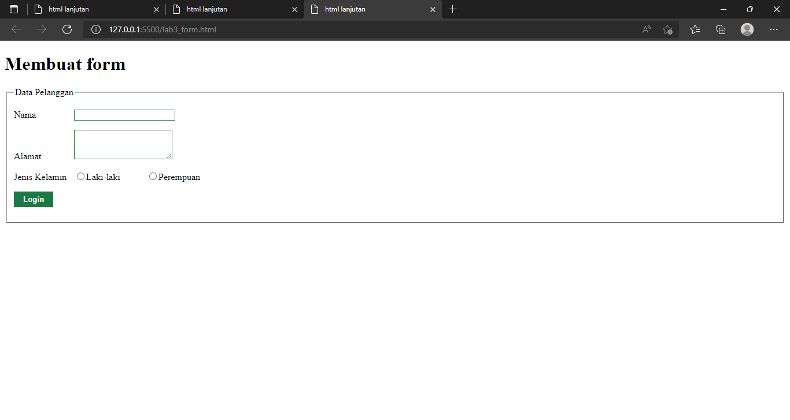

## Mohammaad Rizky
## TI.20.A2
## 312010230

# Pertemuan 4

## Lab 3 Web

## 1. Membuat Ordered list

Ordered list adalah list adalah list yang terurut; Unordered List adalah list yang tak terurut.

**Contoh Kode**
```html
<!DOCTYPE html>
<html lang="en">
<head>
    <meta charset="UTF-8">
    <meta http-equiv="X-UA-Compatible" content="IE=edge">
    <meta name="viewport" content="width=device-width, initial-scale=1.0">
    <title>html lanjutan</title>
</head>
<body>
    <header>
        <h1>Membuat List</h1>
    </header>
    <section id="order list">
        <h2>Order List</h2>
        <ol>
            <li>Pemrograman Web</li>
            <li>Sistem Informasi</li>
            <li>Basis Data 2</li>
        </ol>
    </section>
</body>
</html>
```

## 2. Membuat Unordered List

Unordered list adalah list yang tak terurut yang menggunakan simbol-simbol pada item-nya. Unordered list dibuat dengan tag <ul> dan untuk item-nya dibuat juga dengan tag <li> .

**Contoh Kode**
```html
<section id="Unordered List">
        <h2>Unordered list</h2>
        <ul type="square">
            <li>Jaringan Komputer</li>
            <li>Struktur Data</li>
            <li>Analisa</li>
        </ul>
    </section> 
 ```
## 3. Membuat Description List

list yang ditujukan untuk membuat struktur yang berisi deskripsi atau daftar penjelasan.

**Contoh Kode**
```html
     <section id="unorder-list">
        <h2>Description List</h2>
        <dl>
        <dt>Fakultas Teknik</dt>
        <dd>Teknik Industri</dd>
        <dd>Teknik Informatika</dd>
        <dd>Teknik Lingkungan</dd>
        <dt>Fakultas Ekonomi dan Bisnis</dt>
        <dd>Akuntansi</dd>
        <dd>Manajemen</dd>
        <dd>Bisnis Digital</dd>
        </dl>
        </section>
```
## 4. Membuat Table

membuat tampilan lebih terstruktur sesuai dengan baris dan kolom yang akan dibuat. Table dapat menggunakan tag <table>. Tag untuk mengatur baris adalah : <tr></tr>, dan tag untuk mengatur baris menjadi kolom dapat menggunakan tag <td></td>.

**Contoh Kode**
```html
   <!DOCTYPE html>
<html lang="en">

<head>
    <meta charset="UTF-8">
    <meta http-equiv="X-UA-Compatible" content="IE=edge">
    <meta name="viewport" content="width=device-width, initial-scale=1.0">
    <title>html lanjutan</title>
</head>

<body>
    <header>
        <h1>Membuat Table</h1>
    </header>
    <table border="1" cellpadding="4" cellspacing="0">
        <thead>
            <tr>
                <th>No.</th>
                <th>Fakultas</th>
                <th>Program Studi</th>
            </tr>
        </thead>
        <tbody>
            <tr>
                <td>1.</td>
                <td>Teknik</td>
                <td>Teknik Informatika</td>
            </tr>
            <tr>
                <td>2.</td>
                <td>Teknik</td>
                <td>Teknik Industri</td>
            </tr>
            <tr>
                <td>3.</td>
                <td>Teknik</td>
                <td>Teknik Lingkungan</td>
            </tr>
        </tbody>
    </table>
</body>

</html>
```
## 5. Menambahkan Padding dan Margin

Untuk mengatur margin dan padding pada cel data, tambahkan atribut cellpadding dan
cellspacing pada tag table.

**Contoh Kode**
```html
    <table border="1" cellpadding="10" cellspacing="0">
```
## 6. Menggabungkan sel data

Untuk menggabungkan sel data, gunakan atribut rowspan dan colspan. Atribut rowspan untuk
menggabungkan baris (secara vertikal) dan colspan untuk menggabungkan kolom (secara
horizontal).

**Contoh Kode**
```html
<table border="1" cellpadding="10" cellspacing="0">
        <thead>
            <tr>
                <th>No.</th>
                <th>Fakultas</th>
                <th>Program Studi</th>
            </tr>
        </thead>
        <tbody>
            <tr>
                <td>1.</td>
                <td rowspan="3">Teknik</td>
                <td>Teknik Informatika</td>
            </tr>
            <tr>
                <td>2.</td>
                <td>Teknik Industri</td>
            </tr>
            <tr>
                <td>3.</td>
                <td>Teknik Lingkungan</td>
            </tr>
        </tbody>
    </table>
```
## 7. Membuat Form

formulir HTML pada halaman web memungkinkan pengguna untuk memasukkan data yang dikirim ke server untuk diproses. Formulir dapat menyerupai formulir kertas atau basis data karena pengguna web mengisi formulir menggunakan kotak centang, tombol radio, atau bidang teks.

**Contoh Kode**
```html
<form action="proses.php" method="post">
        <fieldset>
        <legend>Data Pelanggan</legend>
        <p>
        <label for="nama">Nama</label>
        <input type="text" id="nama" name="nama">
        </p>
        <p>
        <label for="alamat">Alamat</label>
        <textarea id="alamat" name="alamat" cols="20" rows="3"></textarea>
        </p>
        <p>
        <label>Jenis Kelamin</label>
        <input id="jk_l" type="radio" name="kelamin" value="L" /><label
        for="jk_l">Laki-laki</label>
        <input id="jk_p" type="radio" name="kelamin" value="P" /><label
        for="jk_p">Perempuan</label>
    </p>
    <p><input type="submit" value="Login"></p>
    </fieldset>
    </form>
```
## 8. Menambahkan Style pada Form

Style di HTML merupakan atribut yang berfungsi untuk menambahkan Style pada sebuah elemen HTML, seperti merubah warna, font, ukuran, dan lain-lain.

**Contoh Kode**
```html
    <style>
        form p > label {
        display: inline-block;
        width: 100px;
        }
        form input[type="text"], form textarea {
        border: 1px solid #197a43;
        }
        form input[type="submit"] {
        border: 1px solid #197a43;
        background-color: #197a43;
        color: #ffffff;
        font-weight: bold;
        padding: 5px 15px;
        }
        </style>
```